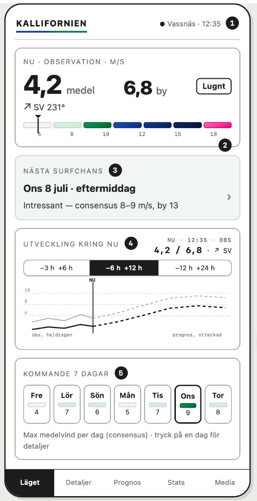
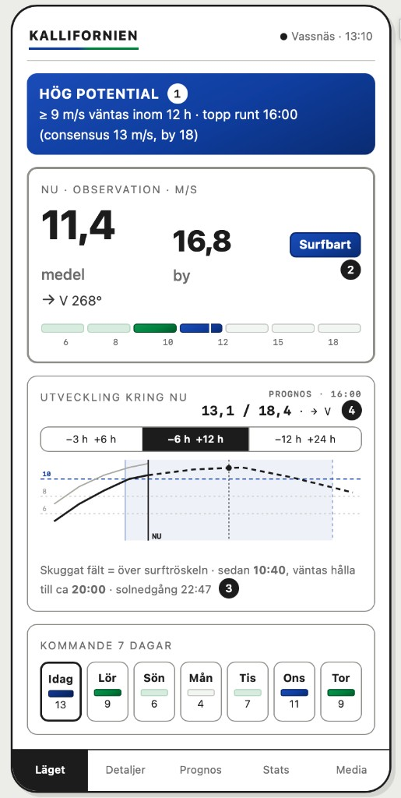
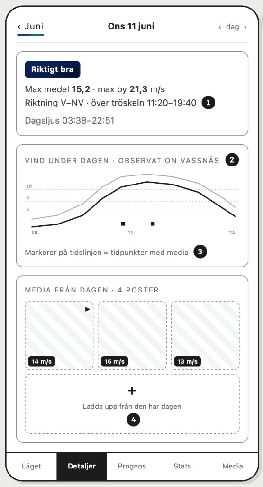
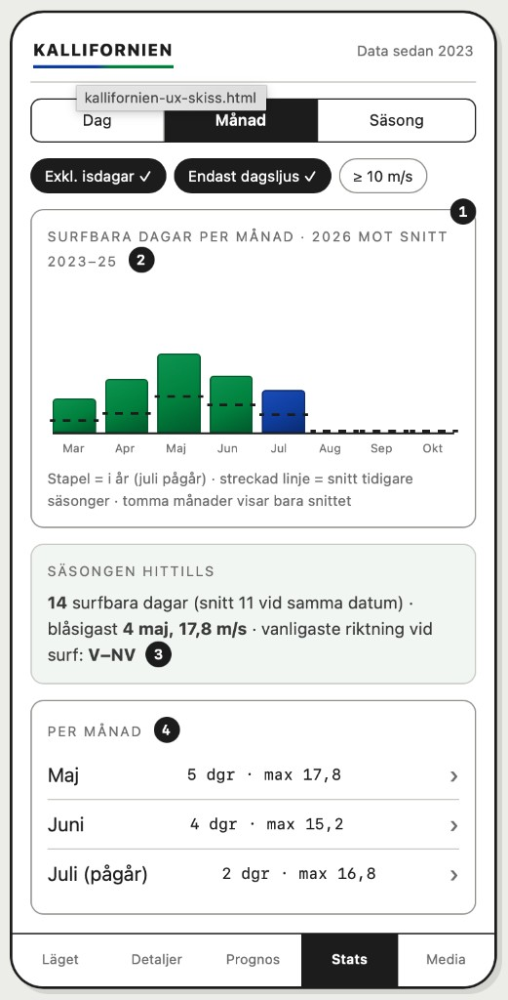
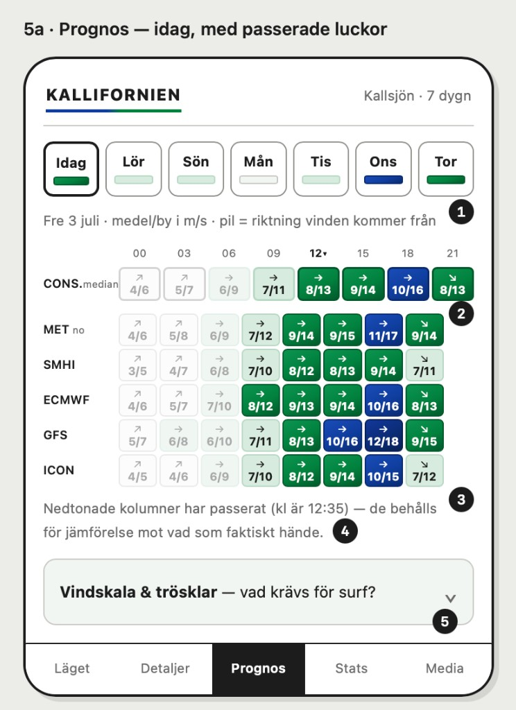
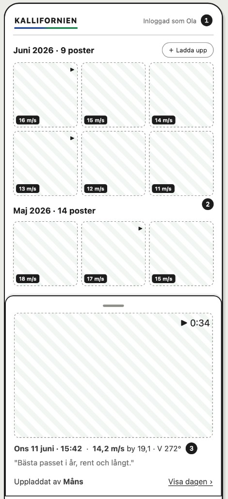
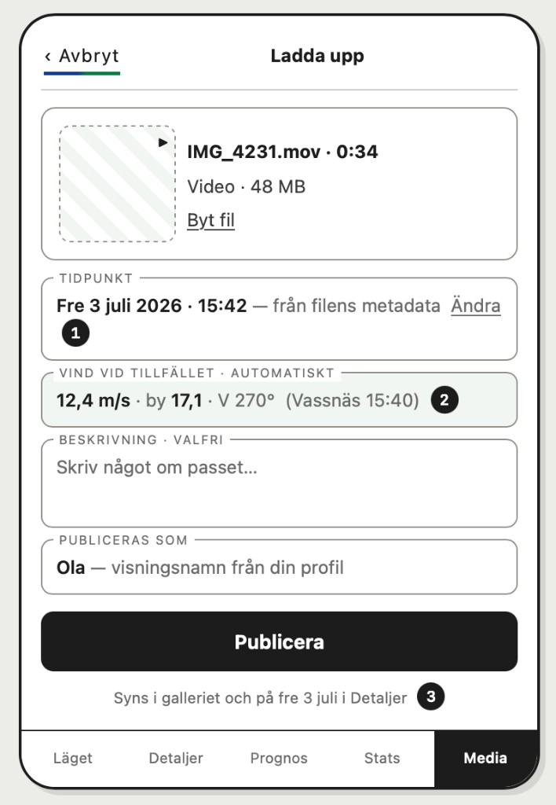
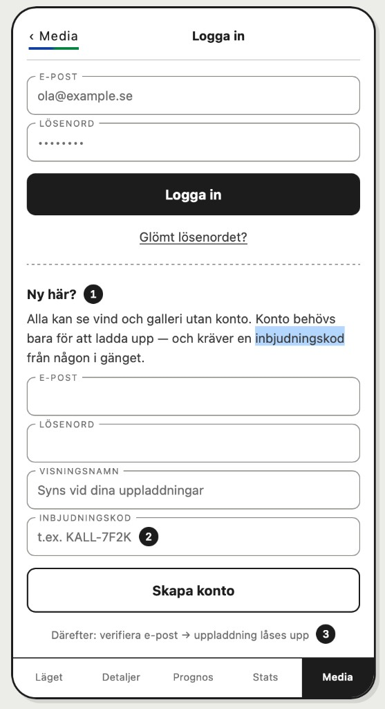

# Kallifornia – appöversikt

Projekt- och produktdokumentation för webbappen **Kallifornia** (`kallsjon-web-app-2024`).

Relaterat: [docs/planer/](planer/) – audit-verifiering och åtgärdsplaner.

---

## Vad är det?

**Kallifornia** är en mobilvänlig **PWA** för **vågsurf** i **Kallsjön**, norr om Åre i Jämtland. Appen svarar på frågan: *blåser det tillräckligt – och när?*

### När kan man surfa?

Vågsurf fungerar i Kallsjön när:

- **Sjön inte är islagd** (säsongsbegränsning – typiskt vår till höst)
- **Ungefär 10 m/s i medelvind** – det brukar krävas för att det ska gå att surfa
- **Ca 15–17 m/s i byvind** ger bra vågor (medel och by hänger ofta ihop)

Det är ingen hård gräns: ju mer det blåser, desto bättre blir det – och det finns ingen övre gräns där vågorna blir sämre.

Appen kombinerar:

- **Observerad vinddata** från väderstationen vid **Vassnäs** (Trafikverket → Firebase Functions → Firestore)
- **Väderprognoser** från SMHI och MET Norway
- **Surfbarhetslogik** baserad på vindstyrka, byar och (i vissa vyer) dagsljus

Appen kan installeras som PWA (lägg till på hemskärmen) och hostas via Firebase Hosting.

**Live:** [https://kallsjon.web.app](https://kallsjon.web.app)

### Syskonprojekt

| Del | Repo | Dokumentation |
|-----|------|---------------|
| **Webbapp** (detta repo) | `kallsjon-web-app-2024` | Denna fil |
| **Vindinsamling** | `2024-kallsjon-functions` | `docs/OVERSIKT.md` i functions-repot |

Båda deployas till samma Firebase-projekt **`kallsjon`**. `firebase.json` och `.firebaserc` ligger i föräldermappen `kallsjon-web-app`:

```
kallsjon-web-app/
├── firebase.json
├── .firebaserc
├── 2024-kallsjon-functions/   ← Cloud Function collectWindData
└── kallsjon-web-app-2024/     ← webbappen (detta repo)
```

---

## Teknik

| Lager | Val |
|-------|-----|
| Frontend | React 19, TypeScript, Vite 6 |
| Styling | Tailwind CSS |
| Routing | React Router 7 |
| Grafer | Recharts |
| Backend/data | Firebase (Firestore, Storage, Auth, App Check) |
| Vindinsamling | Cloud Function `collectWindData` i `2024-kallsjon-functions` |
| Drift | `firebase deploy` från `kallsjon-web-app` (hosting + functions) |

Miljövariabler (`VITE_FIREBASE_*`, m.m.) krävs för Firebase. Se `src/config/firebase.ts`.

**App Check:** Aktivt i produktion. I dev är det opt-in via `VITE_ENABLE_FIREBASE_APPCHECK="true"` (annars loggas varning och App Check hoppas över).

---

## Arkitektur (förenklad)

```
Vassnäs-station → Trafikverket API → Cloud Function → Firestore `wind`
                                                              ↓
SMHI / MET Norway (externa API) ─────────────────────→ React hooks → UI
                                                              ↓
Firestore `dailyStats` / `media_items` ──────────────────────┘
```

### Viktiga hooks

| Hook | Ansvar |
|------|--------|
| `useKallsurfTimeline` | **Huvudvy** – slår ihop observation + prognos till tidslinje, timbuckets och dagsammanfattningar |
| `useWindData` | Firestore `wind`, L1 minnescache + L2 localStorage per månad |
| `useForecastModels` | SMHI + MET Norway + Open-Meteo (ECMWF/GFS/ICON) + consensus, ETag-cache |
| `useForecastMatrix` | Prognos-fliken – 7 dagar × 3h-slots per modell, dagval |
| `useProcessedWindData` | Normaliserar observation + prognos för tidslinje |
| `useDailyStats` / `useMonthlyStats` | Föraggregerad statistik från `dailyStats` |
| `useCacheManager` | Användarstyrd cache-rensning, `ignoreCache`-flagga |

### Nyckelkomponenter

| Komponent | Användning |
|-----------|------------|
| `HeroStats` | NU-kort: medel/by, riktning, nivåbadge, sjustegsmätare |
| `WindScaleMeter` | Sju färgsegment + pil vid aktuell vind (Läget) |
| `NextSurfChance` | Första prognoslucka ≥ Intressant; klick → Detaljer |
| `WindOverviewChart` | Trendgraf med fönster −3+6 / −6+12 / −12+24, fast avläsning, scrubb |
| `DayStrip` / `DailyForecast` | Kommande 7 dagar — bästa vind per dag (delad med Prognos) |
| `ForecastView` / `ModelComparisonGrid` / `ForecastModelCell` | Prognos-fliken — modelljämförelse en dag i taget |
| `HistoryTabs` | Periodgraf 24H / 3D / 7D (Detaljer utan dagval) |
| `DayDetail` | Dagvyn — sammanfattning (nivå, max, tröskelfönster, riktning, dagsljus), dagsgraf med mediamarkörer, dagens media, dag-bläddring, "Jämför modeller" → Prognos |
| `CalendarGrid` | Månadskalender med vindfärger |
| `StatsView` | Säsongsstatistik från `dailyStats` |
| `MediaView` / `MediaUpload` / `DailyGallery` | Galleri och uppladdning |

**Vindfärger:** `src/config/windScale.ts` (trösklar + hex, sjustegsskala) → `src/utils/windColors.ts` (UI-hjälpare). Ingen duplicerad färglogik i komponenter.

---

## Datakällor

### 1. Observerad vind (Firebase `wind`)

Data från **väderstationen i Vassnäs** (bredvid Kallsjön). Mätningar ungefär **var 5:e minut**.

**Dataflöde** (hanteras av syskonprojektet `2024-kallsjon-functions`):

```
Väderstation (Vassnäs)
        ↓
Trafikverket API (WeatherObservation)
        ↓
Cloud Function `collectWindData` (var 5:e minut, europe-west1)
        ↓
Firestore (`wind`)
        ↓
Webappen (useWindData)
```

Funktionen `collectWindData` hämtar observationer från Trafikverkets trafikinfo-API, filtrerar på mätplats **Vassnäs** och skriver nya poster till Firestore (hoppar över dubbletter). Se **`2024-kallsjon-functions/docs/OVERSIKT.md`** för full teknisk beskrivning.

**Firestore-dokument (`wind`):**

| Fält i Firestore | Mappning i webbappen | Betydelse |
|------------------|----------------------|-----------|
| `time` | `time` | Tidpunkt |
| `force` | `windSpeed` | Medelvind (m/s) |
| `forceMax` | `windGust` | Byvind – max senaste 10 min |
| `direction` | `windDirection` | Riktning (grader) |

**Hämtning i appen:** `useWindData` delar upp data i **arkiv** (äldre än ~2 h, stabilt cachebar) och **live** (senaste timmarna, oftare uppdaterat). I huvudvyn hämtas historik från senaste 7 dagar (översikt) eller hel månad (kalendervy).

### 2. Prognoser (externa API:er)

| Modell | Källa | Adapter |
|--------|-------|---------|
| SMHI | `opendata-download-metfcst.smhi.se` | `src/api/smhiAdapter.ts` |
| MET Norway | `api.met.no/weatherapi/locationforecast` | `src/api/metNorwayAdapter.ts` |
| ECMWF / GFS / ICON | `api.open-meteo.com` | `src/api/openMeteoAdapter.ts` |
| Consensus | Beräknad i appen från tillgängliga modeller | `useForecastModels` |

**Koordinater:** `src/config/constants.ts` (`KALLSJON`: lat `63.6275`, lon `13.0565`, altitude `382 m`).

#### Prod vs dev

| Miljö | Prognosmodeller | Consensus |
|-------|-----------------|-----------|
| **Produktion** | MET Norway (SMHI blockeras av CORS i webbläsaren) | Nej – fallback till MET Norway |
| **Lokal dev** | SMHI (via Vite-proxy `/_proxy/smhi`) + MET Norway | Ja – median/max/cirkulärt medel |

I **huvudvyn** (`useKallsurfTimeline`) väljs prognos i ordning: consensus → MET Norway → SMHI. I prod blir det alltså MET Norway.

**Prognoshorisont:** data hämtas **168 timmar (7 dygn)** framåt (`ACTIVE_FORECAST_HOURS`). Trendgrafen på Läget har **valbart fönster** (−3 h +6 h / −6 h +12 h / −12 h +24 h, sparas i `localStorage`); `DailyForecast` visar **Kommande 7 dagar** med bästa vindtillfälle per dag (se [docs/ux/BESLUT.md](ux/BESLUT.md)).

**Prognos-fliken** hämtar dessutom **Open-Meteo** (ECMWF `ecmwf_ifs025`, GFS `gfs_seamless`, ICON `icon_seamless`) via `openMeteoAdapter.ts` — fungerar direkt i webbläsaren (ingen CORS-blockering).

#### Consensus och median

När både SMHI och MET Norway finns tillgängliga beräknar appen **consensus** per timme (`calculateConsensus` i `useForecastModels`):

| Värde | Hur det beräknas |
|-------|------------------|
| Medelvind | **Median** av modellernas värden |
| Byvind | **Maximum** av modellernas värden |
| Vindriktning | **Cirkulärt medel** av modellernas riktningar |

I lokal dev kan båda modellerna jämföras via consensus; i produktion används MET Norway tills SMHI-proxy finns (se [planer/ATGARDPLAN.md](planer/ATGARDPLAN.md) Fas B).

### 3. Aggregerad statistik (Firebase `dailyStats`)

Förkalculerade dagsvärden (max/medel/by m.m.).

| Källa | När |
|-------|-----|
| **Schemalagd Cloud Function** *(planerad — se [planer/PLAN-DAGLIG-STATS.md](planer/PLAN-DAGLIG-STATS.md))* | Varje natt 00:20 — senaste 3 dygnen, idempotent |
| `scripts/aggregateDailyStats.ts` (`npm run aggregate:historical`) | Manuell backfill av längre luckor |
| Klienten (`useDailyStats`) | Dagens datum live från `wind` |

**Användning:** Stats-fliken (`StatsView` → `useDailyStats`) och kalenderfärgläggning för historiska månader (`useMonthlyStats`). Ger betydligt färre Firestore-läsningar än att aggregera rå `wind`-data i klienten.

### 4. Media – bilder och video

Surfare kan ladda upp **bilder och filmer** från surfpass. Media lagras i **Firebase Storage**; metadata i Firestore (`media_items`).

**Var det syns:**

- **Media-fliken** – hela galleriet grupperat per månad
- **Detaljer-fliken** – när en dag är vald (`DayDetail`): dagsgraf med mediamarkörer, **dagens media** (`DailyGallery`) med vindbadge och tid, plus uppladdning för vald dag

**Uppladdning** (`MediaUpload.tsx`):

1. Användaren väljer bild eller video
2. Datum/tid hämtas från **EXIF** (fallback: filens `lastModified`)
3. Appen slår upp **vind vid tidpunkten** (± 2 timmar) från `wind`
4. Filen laddas upp till Storage (`daily_uploads/{datum}/...`)
5. Metadata sparas i Firestore

**Metadata per uppladdning:**

| Fält | Innehåll |
|------|----------|
| `date` | Datum (YYYY-MM-DD) |
| `capturedAt` | Tid (HH:mm) |
| `url` | Nedladdnings-URL från Storage |
| `type` | `image` eller `video` |
| `windData` | Medel, by och riktning vid tidpunkten |
| `description`, `uploaderName` | Frivillig text |
| `originalName` | Originalfilnamn |
| `uploadedBy` | Idag: `guest_with_code` (ingen riktig användaridentitet) |

#### Autentisering idag

Uppladdning och radering styrs av en **delad kod** som valideras i klienten (`MediaUpload.tsx`, `DailyGallery.tsx`). Vid uppladdning loggas användaren in med **Firebase Anonymous Auth** – det ger en session för Storage Rules, men ingen persistent identitet kopplad till personen.

| Aspekt | Nuvarande lösning | Begränsning |
|--------|-------------------|-------------|
| Vem får ladda upp? | Den som känner till delad kod | Koden ligger i appkoden – inte riktig säkerhet |
| Användaridentitet | Valfritt visningsnamn (`uploaderName`) | Ingen koppling till Firebase-konto |
| Radering | Samma delade kod | Samma begränsning |
| Backend | Storage Rules + App Check (prod) | Reglerna är inte dokumenterade i detta repo |

Läsa vinddata och använda appen kräver **ingen inloggning**.

#### Autentisering – planerad riktning

Målet är att kunna **lägga till och hantera riktiga användare i Firebase** – inte en permanent delad kod i klienten.

**Önskat flöde (utkast):**

1. **Konton** – surfare skapar konto via Firebase Auth (t.ex. e-post + lösenord eller magic link).
2. **Verifiering innan upload-rättighet** – kontot får inte ladda upp förrän det godkänts, via något av:
   - **Inbjudan/kod** som admin genererar (ersätter dagens delade kod, men valideras server-side)
   - **Manuellt godkännande** av admin i Firebase Console eller enkel admin-vy
   - **E-postverifiering** som minimum; ev. kombinerat med whitelist
3. **Roller i Firebase** – t.ex. custom claim `uploader: true` eller `role: member` som Storage/Firestore Rules kontrollerar (inte klientkod).
4. **Spam-skydd** vid behov:
   - Firebase **App Check** (redan stöd i appen)
   - **reCAPTCHA** vid registrering
   - **Rate limiting** (Cloud Function eller Firebase Extensions)
   - Ev. moderering/kö för första uppladdning

**Administration:** Nya användare ska kunna läggas till manuellt i Firebase (Console) eller via inbjudan – skalbart för en liten surfgemenskap utan att öppna upp för vem som helst.

**Tekniska steg när det implementeras:**

- Ersätt `signInAnonymously` + delad kod med riktig Auth och server-side behörighetskontroll
- Uppdatera Storage Rules: skriv till `daily_uploads/` kräver autentiserad användare med upload-rättighet
- Spara `uploadedBy: auth.uid` (och ev. `uploaderName` från profil) i `media_items`
- Flytta eventuell inbjudningskod till **miljövariabel / Cloud Function** – aldrig hårdkodad i klienten

**Detaljerad plan:** [planer/PLAN-MEDIA-AUTH.md](planer/PLAN-MEDIA-AUTH.md)

---

## Vyer och routes

Appen har **en enda vy**. Alla paths leder till samma sida.

| Route | Sida | Beskrivning |
|-------|------|-------------|
| `/` | `KallsurfHome` | Surf-dashboard med flikar |
| `*` (övriga) | `KallsurfHome` | Fallback – samma vy |

**Legacy borttaget (juli 2026):** `/classic`, `/home`, `/now`, `/chart`, `/experiments` och tillhörande Chart.js-komponenter (`WindMap`, `WindChart`, m.fl.) finns kvar i git-historik (checkpoint `35570f5` på branchen `new-kall`) men inte i nuvarande kod.

**Manuell uppdatering:** Ingen pull-to-refresh. Live-vind uppdateras automatiskt (~30 s). Refresh-knappar kan läggas till per vy vid behov (se [planer/ATGARDPLAN.md](planer/ATGARDPLAN.md) Fas A).

### Kallsurf Home – flikar

| Flik | Kodnamn | Innehåll |
|------|---------|----------|
| **Läget** | `overview` | NU-kort (observation, nivåmätare), ev. Hög potential-banner, Nästa surfchans, trendgraf (valbart fönster), Kommande 7 dagar |
| **Detaljer** | `history` | Periodgraf (24H / 3D / 7D) + kalender; vid dagval: `DayDetail` (sammanfattning, dagsgraf, media, uppladdning) |
| **Prognos** | `forecast` | Modelljämförelse en dag i taget — consensus + MET + ECMWF/GFS/ICON (+ SMHI i dev) |
| **Stats** | `stats` | Säsongsstatistik från `dailyStats`, filter is/dagsljus/≥10 m/s |
| **Media** | `media` | Galleri och uppladdning |

**Header (alla flikar):** `Vassnäs · HH:MM` med fylld punkt om data &lt; 15 min gammal. Klick på logotypen eller fliken **Läget** återställer dagval (`goToOverview`) så NU-kortet alltid visar aktuell observation.

Central hook: `useKallsurfTimeline`.

### Skärmdumpar

Referensbilder i `docs/images/` — UX-skiss v1.4 (annoterade) och live-app där det finns. Siffrorna i bilderna är guide-markörer från skissen, inte UI i produktion.

**Läget** — lugn dag (NU-kort, Nästa surfchans, trendgraf, Kommande 7 dagar):



**Läget** — surfbart (Hög potential-banner, tröskelskuggning i graf — planerat polish):



**Detaljer** — dagvy enligt skiss Fas E (dagsammanfattning, graf med mediamarkörer, media):



**Stats** — månadsvy med filter och staplar:



**Prognos** — modellgrid en dag, passerade luckor nedtonade:



**Media** — galleri per månad med detaljvy:



**Media — uppladdning** (Fas C-skiss, ej live):



**Media — inloggning** (Fas C-skiss, ersätter delad kod):



| Fil | Status |
|-----|--------|
| `laget.png` | ✅ |
| `laget-surfbart.png` | ✅ (extra: surfbart läge) |
| `detaljer.png` | ✅ (Fas E — implementerad juli 2026) |
| `stats.png` | ✅ (UX-skiss — avviker delvis från prod) |
| `prognos.png` | ✅ (UX-skiss — SMHI-rad kräver Fas B i prod) |
| `media.png` | ✅ (UX-skiss — Fas C) |
| `media-uppladdning.png` | ✅ (Fas C-skiss) |
| `media-inloggning.png` | ✅ (Fas C-skiss) |
| `detaljer-kalender-media.png` | Saknas |

> Nedtonad varningsrad (*"Viss prognosdata kunde inte hämtas"*) syns när prognos-API:et misslyckas. Observationer från Vassnäs fungerar ändå.

---

## Surfbarhet

Surfbarhet är **gradvis** – inte en exakt ja/nej-gräns.

### I verkligheten

| Villkor | Riktlinje |
|---------|-----------|
| Säsong | Öppet vatten – ingen is på sjön |
| Medelvind | Ca **10 m/s** behövs för att det ska gå att surfa |
| Byvind | Ca **15–17 m/s** ger bra vågor |
| Trendering | Ju högre vind, desto bättre – ingen övre gräns |

### I appen (sjustegsskala)

Hela appen använder **sju nivåer** (Lugnt → Sällsynt) enligt [docs/ux/VINDSKALA.md](ux/VINDSKALA.md). Trösklar och färger i `src/config/windScale.ts`; UI-hjälpare i `src/utils/windColors.ts`.

| Nivå | Tröskel (medel m/s) | Surfbart via by |
|------|---------------------|-----------------|
| Lugnt | &lt; 6 | — |
| Håll koll | ≥ 6 | — |
| Intressant | ≥ 8 | — |
| Surfbart | ≥ 10 | **eller** by ≥ 15 |
| Bra | ≥ 12 | — |
| Riktigt bra | ≥ 15 | — |
| Sällsynt | ≥ 18 | — |

**By-regel:** Medel &lt; 10 m/s men by ≥ 15 → minst **Surfbart** vid bedömning av tidsluckor och chip i *Kommande 7 dagar*.

Övrigt på **Läget**:

- **Hög potential:** jämtblå banner om medelvind **&gt; 9 m/s** (strikt) inom kommande 12 timmar
- **Nästa surfchans:** kort som hittar första prognoslucka ≥ **Intressant**; döljs när det redan blåser tillräckligt; klick öppnar dagen i Detaljer
- **Is** filtreras i Stats-vyn (`surfableDays.ts`, default feb 15 – apr 15), men inte i alla vyer

Legacy-alias `WIND_THRESHOLDS` i `windScale.ts` behålls för bakåtkompatibilitet; använd `getEffectiveLevel()` / `getEffectiveLevelIndex()` i ny kod.

---

## Soltider och dagsljus

| Del av appen | Implementation | Syfte |
|--------------|----------------|-------|
| Tidslinje (Läget, Detaljer) | `utils/sunTimes.ts` – **månadstabell** | Snabb `isDaylight`-flagga |
| Stats-fliken | `suncalc` via `daylightCalculations.ts` | Filter "maxvind under dagsljus" |

Dagsljusflaggan påverkar **inte** surfbarhetsnivåerna direkt – den används för visning (t.ex. mörk zon i trendgrafen, fotnot *ljust till …*) och statistikfilter.

---

## Caching

Appen cachar aggressivt för snabb mobilupplevelse.

### Observationer (`useWindData`)

| Lager | TTL / omfattning |
|-------|------------------|
| **L1 minne** | 30 s (live, senaste timmen), 1 min (senaste 7 dagarna), 5 min (historik) |
| **L2 localStorage** | Per månad; hoppar över L2 för live-data om L1 är utgången |
| **Firestore** | Källa vid cache miss |

`useWindData` exponerar `clearCache()` och `IgnoreCacheProvider` – redo för framtida refresh-knappar (se åtgärdsplan Fas A).

### Prognos

| Hook | Cache |
|------|-------|
| `useForecastModels` | localStorage + **ETag** (15 min TTL via `cacheStorage`) |

### Verktyg

- `useCacheManager` – rensa cache per månad/år, dev-flagga `ignoreCache`
- `useWindCache` – localStorage per månad för observationer
- `cacheStorage` – generisk cache med ETag för prognos-API

---

## Projektstruktur

```
src/
├── api/           # SMHI & MET Norway-adaptrar
├── components/
│   ├── kallsurf/  # Huvudvy – flikar, grafer, kalender
│   └── media/     # Galleri & uppladdning
├── config/        # Firebase, konstanter (KALLSJON, trösklar)
├── hooks/         # Datahämtning och bearbetning
├── pages/         # KallsurfHome.tsx (enda sidan)
├── types/         # TypeScript-typer
└── utils/         # Cache, tid, vindkonvertering, soltider

scripts/
└── aggregateDailyStats.ts   # Batch: wind → dailyStats

public/            # PWA-ikoner, manifest, 404-sida

docs/
├── OVERSIKT.md    # Denna fil
├── images/        # Skärmdumpar
└── planer/        # Audit-verifiering och åtgärdsplaner
```

---

## Deployment

Webbappen byggs med `npm run build`. **Deploy sker från föräldermappen** `kallsjon-web-app/` (se [README.md](../README.md)).

```bash
# Hela stacken (hosting + functions) från kallsjon-web-app/
firebase deploy

# Endast webbappen
firebase deploy --only hosting
```

Firebase-projekt: **`kallsjon`**.

**Produktion:** [https://kallsjon.web.app](https://kallsjon.web.app) (Firebase Hosting).

---

## GitHub

| | |
|---|---|
| **Repo** | [github.com/olanygards/kallsjon-web-app-2024](https://github.com/olanygards/kallsjon-web-app-2024) |
| **Branch** | `main` – enbart Kallsurf Home |
| **Legacy-kod** | Finns i git-historik: commit `35570f5` |

---

## Kända begränsningar

| Område | Beskrivning |
|--------|-------------|
| SMHI i prod | CORS blockerar direktanrop; consensus kräver proxy eller server-side fetch (Fas B i åtgärdsplan) |
| Manuell uppdatering | Ingen refresh-knapp än; live-vind auto-uppdateras. Knappar vid behov per vy (Fas A) |
| PWA-splash | `manifest.json` uppdaterat till ljus tema; `public/apple-splash-*.jpg` fortfarande gamla mörkgröna JPG:er |
| Docs-skärmdumpar | Komplett utom `detaljer-kalender-media.png` — se `OVERSIKT.md` |
| Media-auth | Delad uppladdningskod hårdkodad i klienten – ska ersättas med Firebase Auth + roller (Fas C) |
| Bundle-storlek | `KallsurfHome`-chunk >500 kB – ev. code-splitting |

---

## Öppna frågor

- [x] Produktions-URL → [https://kallsjon.web.app](https://kallsjon.web.app)
- [x] Autentisering – media → **Idag:** delad kod + anonym Auth. **Plan:** Firebase-konton med verifiering/inbjudan, roller i Rules, spam-skydd vid behov (se avsnitt *Media → Autentisering*)
- [x] Legacy-vyer → **Borttagna** juli 2026. Checkpoint: `35570f5` på `new-kall`
- [ ] Ska is/säsong modelleras mer explicit utöver Stats-filtret?
- [ ] SMHI/consensus i produktion – Firebase proxy, Cloud Function eller annan lösning?

---

## Relaterad dokumentation

| Dokument | Innehåll |
|----------|----------|
| [docs/ux/BESLUT.md](ux/BESLUT.md) | UX- och designbeslut |
| [docs/ux/VINDSKALA.md](ux/VINDSKALA.md) | Sjustegsskala, trösklar, färger (`windScale.ts`) |
| [planer/ATGARDPLAN.md](planer/ATGARDPLAN.md) | Aktuell åtgärdsplan (inkl. Fas D – prognosvy) |
| [planer/PLAN-PROGNOS-MODELLER.md](planer/PLAN-PROGNOS-MODELLER.md) | Implementationsplan – modellmatris (Open-Meteo) |
| [planer/PLAN-MEDIA-AUTH.md](planer/PLAN-MEDIA-AUTH.md) | Implementationsplan – media-auth |
| [planer/arkiv/](planer/arkiv/) | Historiska dokument (audit före legacy-städning) |
| `2024-kallsjon-functions/docs/OVERSIKT.md` | Vindinsamling (Cloud Function) |

---

*Senast uppdaterad: 2026-07-04 (Fas E — Detaljer-dagvy live)*
